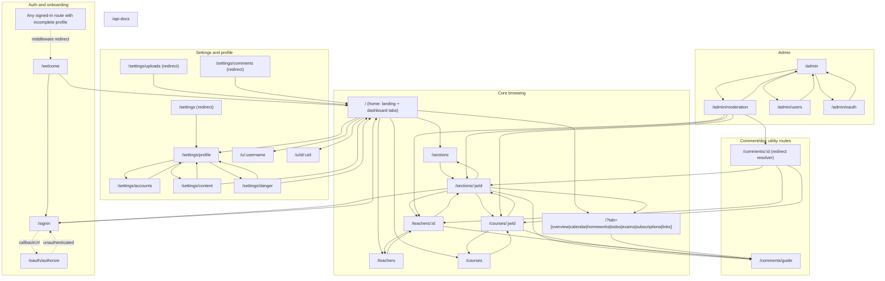
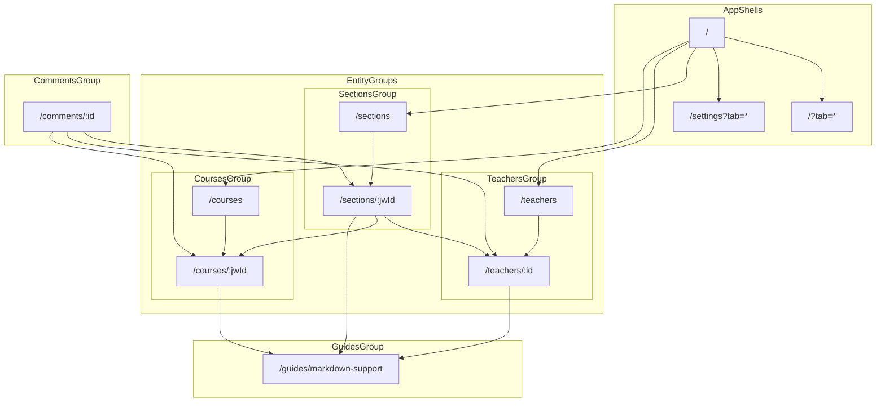
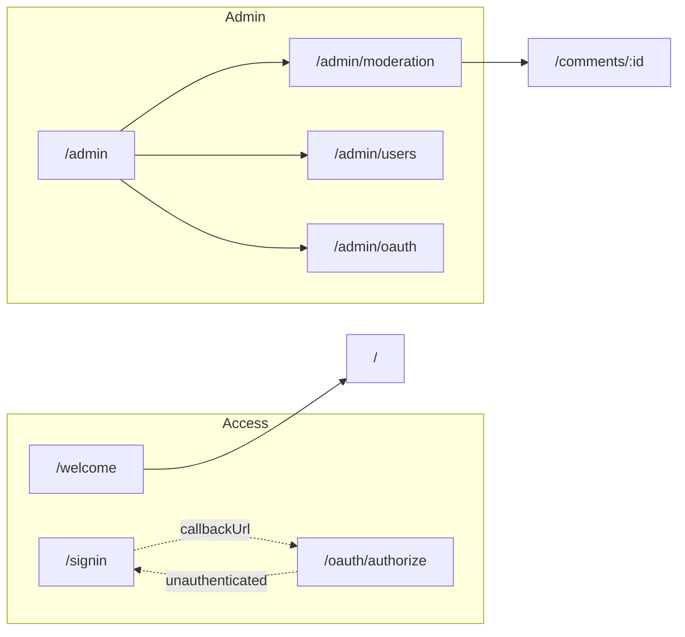

# Design

## Page Link Graph

This graph captures the current page-to-page navigation and redirect behavior in the app router.

- `/` is the main hub: it links to discovery pages (`/sections`, `/teachers`, `/courses`), tabbed dashboard states (`/?tab=...`), settings, and profile pages via global navigation.
- `/comments/:id` is a resolver route; it does not render content itself and redirects to the related section/course/teacher anchor.
- Middleware forces signed-in users with incomplete profiles to `/welcome` before they can use normal pages.
- Settings pages are connected by a shared sidebar (`/settings/profile`, `/settings/accounts`, `/settings/content`, `/settings/danger`), while `/settings` is an index redirect.

## Proposed Layout (Unified Tabs)

This proposal keeps current feature coverage but simplifies navigation into two consistent tab shells: home tabs and settings tabs.

### Core Navigation

### Access And Admin Flows

| Current route | Proposed canonical route |
| --- | --- |
| `/settings/profile` | `/settings?tab=profile` |
| `/settings/accounts` | `/settings?tab=accounts` |
| `/settings/content` | `/settings?tab=content` |
| `/settings/danger` | `/settings?tab=danger` |
| `/comments/guide/` | `/guides/markdown-support/` |

- Unify settings UX with the same tab mental model already used by home dashboard tabs.
- Keep one canonical URL per view, and make menu/sidebar actions point only to canonical routes.
- Move markdown syntax docs out of comments namespace (`/comments/guide/`) into guides namespace (`/guides/markdown-support/`).

## Design System & UI Primitives

The app uses a small, cohesive design system built on:

- **Tokens**: low-level and semantic variables in
  - `src/styles/tokens.css` – brand palette (OKLCH), spacing, radius, typography and layout widths.
  - `src/app/globals.css` – app-shell theme variables (`--background`, `--foreground`, `--card`, `--primary`, etc.) and Tailwind color bridge via `@theme inline`.
  - `tailwind.config.ts` – border radius and shadow utilities mapped to token variables for consistency between CSS and Tailwind classes.
- **UI primitives (`src/components/ui`)**:
  - **Form controls**: `Input`, `Textarea`, `Select`, `NumberField` share a unified `ControlSize` (`"sm" | "default" | "lg"`) type from `src/components/ui/types.ts` and consistent container styling (border, radius, focus ring, invalid/disabled states).
  - **Surfaces**: `Card` and its slots (`CardHeader`, `CardTitle`, `CardDescription`, `CardPanel`, `CardFooter`, `CardAction`) define the standard panel appearance used across dashboard and settings.
  - **Feedback & structure**: `Empty*` components (`Empty`, `EmptyHeader`, `EmptyTitle`, etc.) provide a consistent empty-state pattern, and components like `Badge`, `Alert`, `Toast`, `Spinner` reuse the shared color and radius tokens.
  - **Buttons**: `Button` + `buttonVariants` (via `class-variance-authority`) define size and variant combinations; unit tests in `tests/unit/ui-button.test.ts` ensure variants map to the expected semantic classes.

### Page-Level Layout Components

Page layout is standardized via `src/components/page-layout.tsx`:

- **`PageLayout`**: wraps a page’s main content with:
  - `breadcrumbs` – optional React node rendered above the header (typically a `<Breadcrumb>`).
  - `title` / `description` – displayed using the typography scale (`text-title`, `text-title-2`, etc.).
  - `children` – arbitrary page content, usually a grid of `Card`/`PageSection` components.
- **`PageSection` / `Panel`**: card-like section container that composes:
  - `title`, `description`, `actions` into a `CardHeader` with optional `CardAction`.
  - `children` into `CardPanel`.
  - optional `footer` into `CardFooter`.

The settings layout has been migrated to this API:

- `src/app/settings/layout.tsx` now uses `PageLayout` with:
  - `breadcrumbs` wired to the `Breadcrumb` UI component.
  - `title`/`description` sourced from `next-intl` translations.
  - main content as a two-column grid: sticky `SettingsNav` sidebar + section content.

### Testing And Guardrails

- **Unit tests**:
  - `tests/unit/ui-button.test.ts` asserts `buttonVariants` produce the correct semantic classes for common variants and sizes, protecting against accidental changes to the button API.
  - `tests/unit/page-layout.test.tsx` uses `renderToStaticMarkup` to verify that `PageLayout` correctly renders breadcrumbs, header (title + description), and children.
- **E2E tests**:
  - Existing Playwright suites under `tests/e2e/src/app/**` validate that navigation and key pages (home, settings, uploads, comments, etc.) continue to behave and render correctly after design-system changes.

When adding new UI or pages, prefer:

- Consuming existing primitives from `src/components/ui` instead of writing ad-hoc Tailwind class strings.
- Using `PageLayout` and `PageSection`/`Panel` for page shells and panels, so that typography, spacing, and borders stay consistent without re-implementing layout patterns.
