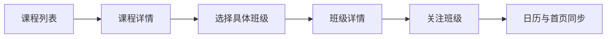
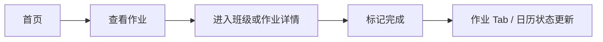

# Life@USTC 功能需求

Life@USTC 是面向中国科大学生的学习工作台，并兼顾高频校园生活服务。产品将教务数据、课程与班级信息、课表、作业、考试、个人待办、校车时刻表和常用链接整合到同一入口，降低学生在多个平台之间查找、确认和维护信息的成本。

## 1. 范围

### 1.1 背景

中国科大学生需要处理的信息分散在多个来源：

* 教务系统中的学期、课程、班级、课表和考试。
* 课程或班级相关的作业、讨论和补充说明。
* 个人待办、日历订阅、校车时刻表和常用链接。

这些信息最终围绕“用户在某学期关注的具体班级”组织。班级是课程在某学期的教学实例，用户与班级之间的关注关系决定首页、日历、作业和考试的个性化展示范围。

### 1.2 产品目标

* 为已登录用户提供个人工作台，集中展示今日与本周课表、临近截止作业、未完成待办和即将到来的考试。
* 为匿名访客和未完成个人化配置的用户提供公开浏览入口，包括课程、班级、教师、校车和常用链接。
* 为外部客户端和 Agent 提供受控访问能力，包括 REST API、OpenAPI 文档和 MCP 工具。
* 为管理员提供平台维护能力，包括评论审核、描述维护、用户管理、OAuth 客户端管理、校车与基础数据维护。

### 1.3 非目标

Life@USTC 不替代官方教务系统：

* 不提供官方选课能力。
* 不提供成绩、学籍、培养方案审批等官方教务能力。
* 不改变教务系统中的课程、班级、课表或考试事实。

## 2. 核心旅程

### 2.1 新用户建立个人工作台

### 2.2 从课程发现具体班级

### 2.3 处理班级作业

## 3. 功能需求

### 3.1 用户与身份

* 角色：

  * 匿名访客：可浏览公开课程、班级、教师、校车和常用链接，并可从公开页面进入登录流程；不能管理个人状态，不能创建待办，不能维护作业完成状态，不能发表登录态评论或上传附件。
  * 普通用户：可关注班级，管理待办，标记作业完成状态，导出 iCal，固定常用链接，保存校车偏好，发表评论、回复、反应和上传附件，管理个人资料与 OAuth 连接；不能修改教务只读数据，不能修改他人的待办、评论、上传或作业完成状态，不能断开最后一个可登录 OAuth 账户。
  * 管理员：可审核评论，维护描述、用户、封禁、OAuth 客户端和校车数据，处理用户内容与平台安全问题；不通过普通页面改变官方教务来源数据。
  * 外部客户端 / Agent：可在 OAuth 授权后访问受限 REST API 或 MCP 工具；默认不暴露管理员能力，不创建独立于 Web 的业务模型。
* 登录与首次资料：

  * 新用户首次登录后必须完成姓名和用户名设置。

    * Web：相关流程发生在 `/signin` 与 `/welcome`。
    * API：当前不单独暴露对应接口。
    * MCP：当前不提供对应写入能力。
  * 登录成功后应返回用户原本尝试访问的页面；没有来源页面时返回首页。

    * Web：通过会话流程实现。
    * API：当前不单独暴露对应接口。
    * MCP：当前不提供对应写入能力。
* 公开主页与个人资料：

  * 用户公开主页支持通过 `/u/$username` 访问；`/u/id/$uid` 提供按用户 ID 访问的主页，并展示用户 ID。
  * 公开主页展示头像、昵称或姓名、`@$username`、加入时间和贡献概览。
  * 贡献概览包括关注班级数、评论数、上传数、创建作业数和近一年贡献图。

    * Web：通过 `/u/[username]` 与 `/u/id/[uid]` 提供。
    * API：当前不单独暴露对应接口。
    * MCP：`get_my_profile` 返回一致的核心资料字段。
* OAuth 登录与账户连接：

  * 用户可以通过 USTC、GitHub、Google 登录。
  * 出于安全和维护成本考虑，系统不提供自建账户密码登录。
  * 用户可以在 `/settings/accounts` 查看和管理已连接的 OAuth 账户。
  * 用户可以断开非最后一个可登录账户。
  * 用户尝试断开最后一个可登录账户时，系统必须给出明确错误反馈。

    * Web：登录入口位于 `/signin`，账户连接管理位于 `/settings/accounts`。
    * API：登录与会话由认证路由承接；外部客户端发现和注册能力在 OAuth 授权章节描述。
    * MCP：不提供登录或账户连接管理能力；登录后仅可通过 `get_my_profile` 读取用户信息。

### 3.2 教务对象、关注班级与个人工作台

* 总体原则：

  * 本节中的学期、课程、班级、教师、课表和考试等教务对象，其事实来源均为教务系统或教务导入数据。
  * 这些数据的事实来源不在 Life@USTC；Life@USTC 负责读取、组织、展示和围绕它们构建个人工作台能力。
* 学期：

  * **「学期」** 指教学时间范围，用于组织课程、班级、课表和考试。
  * 用于组织课程、班级、课表、考试和跨学期展示。
  * 当前学期必须来自明确业务规则，不能只按自然年份粗略推断。

    * Web：在课程、班级、首页和筛选场景中消费学期结果。
    * API：通过 `/api/semesters` 与 `/api/semesters/current` 提供。
    * MCP：当前不单独暴露学期工具，而是在课程、班级、时间线和概览结果中携带必要的学期信息。
* 课程：

  * **「课程」** 指稳定课程实体，例如“数学分析 A1”。
  * 课程列表支持按课程名、英文名、课程代码搜索，并支持按类别、层次、类型筛选。
  * 课程详情展示基础信息、下属班级、评论和描述。

    * Web：列表位于 `/courses`，详情位于 `/courses/[jwId]`。
    * API：通过 `/api/courses` 提供课程搜索与详情所需数据。
    * MCP：通过 `search_courses` 提供同类能力。
* 班级：

  * **「班级」** 指某门课程在某学期的具体教学班。
  * 列表支持搜索、学期筛选、清除筛选和进入详情。
  * 详情展示课程名、班级号、学期、教师、学分、课表、考试、作业、评论和描述。
  * 支持单独导出班级 iCal。
  * UI 中涉及关注动作时，应在合适位置明确说明这不是正式教务系统选课。

    * Web：列表位于 `/sections`，详情位于 `/sections/[jwId]`，班级 iCal 入口位于班级详情页。
    * API：通过 `/api/sections`、`/api/sections/[jwId]`、`/api/sections/calendar.ics` 与 `/api/sections/[jwId]/calendar.ics` 提供。
    * MCP：通过 `get_section_by_jw_id` 提供班级读取能力；当前不提供单独的班级 iCal 工具。
* 教师：

  * **「教师」** 指授课人信息。
  * 列表支持搜索、院系筛选和分页。
  * 详情展示教师信息、相关班级、评论和描述。

    * Web：列表位于 `/teachers`，详情位于 `/teachers/[id]`。
    * API：通过 `/api/teachers` 提供教师搜索与详情数据。
    * MCP：当前不单独暴露教师工具，而通过课程和班级相关结果间接返回教师信息。
* 关注班级关系：

  * **「关注班级关系」** 指用户在 Life@USTC 中关注或取消关注某个班级的个人关系。
  * 产品动作可使用 **「订阅班级」**，但不得写成 **「选课」** 或暗示官方教务关系。
  * 该关系仅表示站内关注，不代表官方选课结果，也不表示教务系统中的学生与教学班关系。
  * 需要在相关 UI 和 MCP 结果中明确说明这不是正式教务系统选课。
  * 用户可以关注或取消关注班级。
  * 关注关系只属于当前用户。
  * 关注关系决定首页、个人日历、作业列表和考试列表的展示范围。
  * 用户可以通过课程代码批量匹配班级。
  * 批量匹配结果必须展示成功项、失败项、使用学期和待确认班级。
  * 用户确认后才建立关注关系。
  * 首页 subscriptions 标签页按学期组织用户已关注班级。
  * 用户没有关注当前学期班级时，应展示可恢复空状态。
  * 用户可以复制个人 iCal 链接。
  * 欢迎页与首页空状态应优先提供搜索班级、从课程进入班级和课程代码批量匹配三个入口。

    * Web：相关流程由首页空状态、课程页、班级页和 `/?tab=subscriptions` 承接。
    * API：通过 `/api/sections/match-codes`、`/api/calendar-subscriptions`、`/api/calendar-subscriptions/current` 和 `/api/users/[userId]/calendar.ics` 提供。
    * MCP：通过 `match_section_codes`、`subscribe_my_sections_by_codes` 和 `get_my_calendar_subscription` 提供。
* 课表与日历：

  * **「课表」** 指班级的上课时间、地点和周次。
  * 课表来自教务系统或导入数据，普通用户不能修改。
  * 班级详情页应展示完整课表上下文。
  * 个人日历整合已关注班级的上课时间、作业截止时间、考试时间和个人待办截止时间。
  * 日历支持学期、月、周视图；周视图以周日作为一周开始。
  * 事件卡片展示时间、标题、状态、来源对象和跳转动作，并支持跳转到相关班级、作业、考试或首页标签页。
  * 首页日历和班级日历应尽量复用一致的卡片、hover 或 popover 以及跳转行为。

    * Web：通过 `/?tab=calendar` 和班级详情页提供。
    * API：通过 `/api/schedules`、`/api/sections/[jwId]/schedules` 和 `/api/sections/[jwId]/schedule-groups` 提供。
    * MCP：通过 `list_my_schedules`、`list_schedules_by_section` 和 `get_my_7days_timeline` 提供相关能力。
* 作业、待办与考试：

  * **「作业」** 指依附于班级的学习任务。
  * **「作业完成状态」** 指用户对某个作业的个人完成标记。
  * **「待办」** 指用户个人任务，不依附班级。
  * **「考试」** 指班级的考试安排。
  * 作业依附于班级，不是用户个人待办；字段包括标题、Markdown 内容、发布时间、开始提交时间、截止时间、重要标记和组队标记。
  * 登录且未封禁用户可以为存在的班级创建作业；当前不要求用户已关注该班级。
  * 登录且未封禁用户可以更新未删除作业；删除权限限于创建者与管理员。
  * 每个用户拥有独立的作业完成状态；完成状态变化不得修改作业本身。
  * 作业应展示创建者信息；截止时间变更后，首页、作业列表与日历中的相关展示应同步更新。
  * 作业描述可随作业创建或更新一并维护。
  * 当前阶段至少保留最近更新时间；是否保留编辑历史可后续增强。
  * 待办是用户个人任务，不依附班级。用户可以创建、编辑、完成和删除自己的待办；有截止时间的未完成待办应进入个人日历；已完成待办可保留历史，但不应继续作为紧急项突出展示。
  * 考试依附于班级，是高优先级时间事件。普通用户不能修改考试；管理员或导入流程负责维护考试数据；跨学期浏览时必须展示学期。

    * Web：通过 `/?tab=homeworks`、`/?tab=todos` 与 `/?tab=exams` 提供。
    * API：通过 `/api/homeworks`、`/api/homeworks/[id]`、`/api/homeworks/[id]/completion`、`/api/todos` 与 `/api/todos/[id]` 提供。
    * MCP：通过 `list_my_homeworks`、`set_my_homework_completion`、`list_homeworks_by_section`、`create_homework_on_section`、`update_homework_on_section`、`list_my_todos`、`create_my_todo`、`update_my_todo`、`delete_my_todo`、`list_my_exams` 和 `list_exams_by_section` 提供。
* 首页概览：

  * 首页默认承载“接下来该做什么”的判断任务。
  * 首屏应优先展示当前学期范围内的个人学习任务，而不是历史学期内容或完整目录信息。
  * 首页概览包含常用链接、今日和明日课表、本周日历、未完成作业和未完成待办。
  * 作业和待办按今日截止、近期截止和全部未完成分组展示。
  * 无截止时间作业不得进入临近截止排序。
  * 非当前学期关注班级不得伪装成当前学习任务。

    * Web：首页概览位于 `/?tab=overview`。
    * API：当前不单独暴露概览接口。
    * MCP：通过 `get_my_overview` 提供同类概览能力。
* 展示与权限：

  * 列表页用于发现、筛选和消歧，应展示足够的学期、班级号、教师、时间地点等判别字段。
  * 详情页用于展示完整信息和上下文操作，应展示完整学期、班级号、教师、时间地点、评论和描述。
  * 卡片用于快速扫描和处理当前任务，应减少重复字段，优先展示下一步动作。
  * 空间有限时，优先展示课程名；展示班级相关信息时，优先展示课程名，再展示教师、时间地点等判别信息。
  * 班级号、学期、课程序号主要用于搜索、导入、详情页、管理后台和消歧。
  * 首页课程事件默认优先展示课程名、时间、地点、教师；作业卡片优先展示截止时间、作业标题、课程名、完成状态、重要标记、组队标记；考试卡片优先展示考试时间、课程名、地点、考试类型、班级号。
  * 默认假定每位学生在一个学期内不会同时关注同一课程的两个班级。
  * 在首页、日历、作业和考试卡片中，可以用课程名代表用户已关注的具体班级，不必总是同时展示班级号和学期。
  * 在课程详情页下属多个班级、班级搜索结果、批量导入和匹配结果、跨学期浏览、管理后台、数据冲突，以及用户确实关注了同一课程的多个班级时，必须保留班级号或学期。
  * 作业、待办和考试应保持一致的卡片扫描方式，包括标题位置、状态位置、时间和截止信息表达。
  * 首页日历和班级日历应尽量复用一致的事件卡片、hover 或 popover 行为、跳转行为和空状态表达。
  * 移动端和桌面端都必须保证内容不溢出、不遮挡，关键动作可见且可操作。
  * 普通用户不能修改课表和考试。
  * 用户只能管理自己的作业完成状态和待办。

### 3.3 评论、描述、上传、校车与常用链接

* 评论：

  * **「评论」** 指依附于课程、班级、教师、作业等对象的讨论内容。
  * 评论依附于班级、课程、教师、作业和班级-教师关系，不提供脱离对象上下文的独立社区入口。
  * 支持 Markdown、数学公式、emoji、表格、回复和反应。
  * 作者可以编辑或删除自己的评论；被封禁用户不能发表新评论；管理员可以隐藏、删除、审核评论，并处理举报或封禁。
  * 可见性支持公开、仅登录用户可见和匿名发表。匿名发表默认仅对普通用户匿名；管理员在审核、举报和安全处理场景下可查看真实作者。匿名评论作者仍可编辑或删除自己的评论。
  * 评论与描述应放在对象详情页中，不应脱离对象上下文成为独立入口。
  * 表单提交、删除、封禁等操作必须有清晰反馈。

    * Web：当前主要通过对象详情页承载评论交互。
    * API：通过 `/api/comments`、`/api/comments/[id]`、`/api/comments/[id]/reactions`、`/api/admin/comments` 和 `/api/admin/suspensions` 提供。
    * MCP：当前不提供评论读写能力。
* 描述：

  * **「描述」** 指对象上的 Markdown 补充说明。
  * 依附于课程、班级、教师或作业等对象。
  * 登录且未封禁用户可维护描述；管理员后台提供描述审核和维护入口。
  * 当描述与评论中的个人经验冲突时，描述优先视为平台维护信息，评论保留为用户观点。

    * Web：当前通过对象详情页展示描述。
    * API：通过 `/api/descriptions` 与 `/api/admin/descriptions` 提供读写能力。
    * MCP：当前不提供通用对象描述维护工具；作业工具可随作业创建或更新维护作业描述。
* 上传：

  * **「上传」** 指评论中的附件。
  * 用于评论附件。
  * 上传前必须检查权限和配额，下载必须校验访问权限。
  * 不提供脱离对象上下文的独立资源浏览入口。
  * 当前下载按上传所有者校验访问权限，不能因拿到下载链接而绕过授权校验。

    * Web：当前通过评论附件流程触发上传。
    * API：通过 `/api/uploads`、`/api/uploads/complete`、`/api/uploads/[id]` 和 `/api/uploads/[id]/download` 提供。
    * MCP：当前不提供上传能力。
* 校车：

  * 匿名用户可查询校车信息；登录用户可查询校车信息并保存偏好。
  * 支持查询校区之间的路线和路线时刻表。时刻表区分工作日和周末，默认使用当前日期类型。

    * Web：位于 `/?tab=bus`。
    * API：通过 `/api/bus` 与 `/api/bus/preferences` 提供。
    * MCP：通过 `query_bus_timetable`、`list_bus_routes` 和 `get_bus_route_timetable` 提供能力。
* 常用链接：

  * 首页应提供常用校内外系统链接。
  * 搜索支持中文、拼音和空白字符容错。
  * 登录用户可以固定链接、取消固定链接和记录点击。
  * 链接用于导航，按钮用于动作。
  * 重要空状态必须给出下一步入口。

    * Web：位于 `/?tab=links`。
    * API：通过 `/api/dashboard-links/pin` 与 `/api/dashboard-links/visit` 提供。
    * MCP：当前不提供常用链接管理能力。
* 权限与可见性：

  * 匿名评论在用户侧不暴露真实身份，在管理员审核和安全处理场景下可追溯。
  * 上传和下载必须经过权限校验。

### 3.4 管理后台、OAuth、API 文档与 MCP 入口

* 管理后台：

  * 仅面向管理员。
  * 支持评论审核、描述维护、用户搜索、用户编辑、封禁、解封、OAuth 客户端管理和校车数据管理。
  * 管理员维护教务相关数据时，应通过导入或后台管理流程完成。
  * 删除、封禁、隐藏等高风险操作必须提供明确反馈。
  * 作业删除、描述修改和管理操作应至少保留最近操作者与最近更新时间。

    * Web：通过 `/admin/*`、`/admin/moderation` 和 `/admin/bus` 提供。
    * API：管理能力分布在对应管理接口中，不单独再定义一套后台协议入口。
    * MCP：当前不定义独立管理员工具。
* OAuth 授权：

  * 系统支持第三方客户端授权。
  * 授权页 `/oauth/authorize` 必须展示应用名称、请求权限、同意操作和拒绝操作。
  * 外部客户端通过授权后的 token 访问受限 API 或 MCP。
  * 用户只能授权或拒绝第三方客户端。
  * 动态客户端注册通过公开注册接口完成；管理员后台提供 OAuth 客户端管理能力。
  * 断开最后一个可登录账户必须失败，并说明原因。

    * Web：授权页位于 `/oauth/authorize`。
    * API：通过 `/api/auth/.well-known/openid-configuration` 提供发现信息，通过 `/api/auth/oauth2/register` 提供动态客户端注册。
    * MCP：不提供 OAuth 管理能力。
* API 文档与 MCP 入口：

  * API 和 MCP 应暴露 Web 页面已能获取到的核心信息。
  * API 和 MCP 不应创建另一套独立产品模型。
  * MCP 默认聚焦个人学习工作台能力。
  * MCP 默认不暴露管理员能力。
  * MCP 默认输出任务摘要；调用方明确请求结构化结果时，可返回班级号、学期、教务 ID 等完整字段。
  * MCP 写操作应区分个人状态写入与内容协作写入；高风险写操作应保留额外确认或权限校验空间。

    * Web：通过 `/api-docs` 展示文档入口。
    * API：通过 `/api/openapi` 与 `/api/mcp` 提供入口。
    * MCP：通过 `/api/mcp` 作为协议入口，由具体工具承载能力。

## 4. 边界场景

### 4.1 学期

* 当前学期不存在时，首页应展示可恢复空状态，并引导用户浏览或导入班级。
* 用户只有非当前学期关注班级时，首页不应伪装成有当前学习任务，应明确提示当前学期未关注班级。
* 用户跨学期浏览时，课程、班级、作业和考试必须展示学期。

### 4.2 消歧

* 多个课程同名时，应展示课程代码或其他消歧信息。
* 用户关注同一课程的多个班级时，应展示班级号和学期。
* 班级搜索、课程详情下属班级和批量导入结果必须展示足够消歧字段。

### 4.3 缺失数据

* 班级缺教师、地点或考试时间时，应展示缺省状态，不应隐藏整个对象。
* 作业没有截止时间时，不进入“临近截止”排序，但仍可在作业列表中查看。
* iCal 链接无可导出事件时，应返回有效但为空或提示性的日历内容。

### 4.4 账户

* 用户修改用户名后，新主页应可访问。
* 旧用户名不应继续代表该用户。
* OAuth 连接重复或断开最后账户时，应给出明确错误反馈。

### 4.5 内容与安全

* 被封禁用户不能发表新评论。
* 上传附件下载必须校验访问权限。
* 删除、封禁、隐藏等高风险操作必须有明确反馈。
